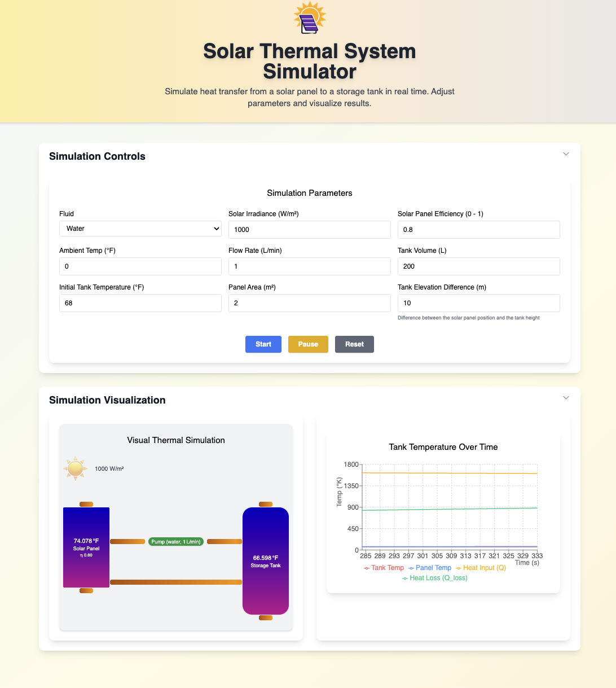

# Physics Simulator Coding Exercise - Desmond

<!-- 
 -->

## 🖥️ Watch the demo

Watch Demo on [Youtube](https://youtu.be/10L8m4ujDA0)
[](https://youtu.be/QDBnxJsE0b8)

_Video: Video of the solar thermal system showing the Sun, Solar Panel, Pump, and Storage Tank in a closed-loop heat transfer system exposed to environmental conditions._

See link to Physics Simulator Coding [Exercise](./public/assets/physics-simulator-coding-exercise.pdf)

## 🛠️ Project Overview

This project simulates heat transfer in a solar thermal system, modeling the flow of energy from a solar panel to a storage tank via a circulating fluid. The simulation is interactive, allowing users to adjust system parameters and visualize the results in real time.

---

## 🌟 Features

- **Real-time simulation** of solar thermal physics
- **Adjustable parameters:**
  - Fluid type (Water or Glycol)
  - Solar irradiance (W/m²)
  - Solar panel efficiency (0-1)
  - Ambient temperature (°K)
  - Flow rate (L/min)
  - Tank volume (L)
  - Initial temperature (°K)
  - Panel area (m²)
  - Tank elevation difference (m) — positive means tank is above panel (enables gravity-driven return)
- **Live-updating chart** of tank and panel temperatures, heat input, and heat loss
- **Responsive, mobile-friendly, and beautiful UI** (Tailwind CSS)
- **Start, Pause, and Reset** simulation controls
- **Physics-based calculations** for heat transfer and energy balance
- **Dynamic color visualization** of temperature changes in panel and tank
- **Automatic panel management** for optimal viewing experience

---

## 🖥️ UI/UX

- **Header:** Project title and description
- **Control Panel:** Inputs for all simulation parameters, with clear labels and units
  - Includes 'Tank Elevation Difference (m)' to model gravity/thermosiphon return
- **Visualization Panel:**
  - Interactive diagram showing system components with temperature-based color gradients
  - Real-time temperature display for panel and tank
  - Solar irradiance visualization
- **Chart Panel:** Responsive line chart (Recharts) showing:
  - Tank temperature over time
  - Panel temperature over time
  - Heat input (Q)
  - Heat loss (Q_loss)
- **Buttons:** Start, Pause, and Reset for simulation control
- **Accordion Panels:** Collapsible sections for controls and visualization

---

## ⚙️ Implementation Details

### **Tech Stack**

- **Framework:** React 18 + TypeScript
- **Styling:** Tailwind CSS
- **Charts:** Recharts
- **Forms:** react-hook-form
- **State Management:** useReducer, useRef, useState
- **Icons:** @heroicons/react

### **Folder Structure**

```
src/
  components/      # UI components (Header, ControlPanel, ChartPanel)
  hooks/           # useSimulation custom hook
  models/          # Physics models (Fluid, SolarPanel, Pump, StorageTank, Environment)
  types/           # Shared types/interfaces
  utils/           # Physics formulas
```

### **Simulation Flow**

- The simulation models the top pipe as pump-driven and the bottom pipe as a passive return:
- If the pump is ON (flow rate > 0), flow is as set by the user.
- If the pump is OFF (flow rate = 0), the simulation checks for passive return:
  - If the tank is above the panel (positive elevation difference), gravity-driven flow is enabled.
  - If the panel is hotter than the tank, thermosiphon flow is enabled.
  - Otherwise, flow is zero and heat transfer stops.

1. **Initialize Parameters:** Fluid, irradiance, efficiency, ambient temp, flow rate, tank volume, initial temp, panel area, **tank elevation difference**
2. **Start Simulation Loop:** 1-second ticks, updating system state
3. **On Each Tick:**
   - Compute heat input from the sun
   - Compute heat loss to the environment using dynamic heat transfer coefficient
   - Calculate mass flow rate from flow rate and fluid density
   - Calculate panel outlet temperature
   - Calculate energy delivered to the tank
   - Update tank and panel temperatures
   - Store results for charting
4. **Display Results:**
   - Live chart updates
   - Dynamic color gradients in panel and tank visualization
   - Real-time temperature displays

---

## 🌡️ Physics & Formulas

### **Key Variables**

- **Irradiance (W/m²):** Solar power per unit area
- **Efficiency (0-1):** Base efficiency of the solar panel at reference temperature
- **Panel Area (m²):** Surface area of the solar collector
- **Ambient Temp (°K):** Outside temperature in Kelvin
- **Flow Rate (L/min):** Circulation rate of the fluid
- **Tank Volume (L):** Storage capacity
- **Initial Temp (°K):** Starting temperature in Kelvin
- **Fluid Properties:** Specific heat (J/kg·K), density (kg/m³)

### **Temperature-Dependent Properties**

#### **1. Air Properties**

All air properties are calculated based on the film temperature (average of panel and ambient temperatures):

```typescript
// Air density (kg/m³) using ideal gas law
ρ = P/(R*T)  // P = 101325 Pa, R = 287.05 J/(kg·K)

// Air viscosity (kg/(m·s)) using Sutherland's formula
μ = μ₀ * (T₀ + S)/(T + S) * (T/T₀)^1.5
// where S = 110.4K, T₀ = 273.15K, μ₀ = 1.716e-5 kg/(m·s)

// Air thermal conductivity (W/(m·K))
k = k₀ + slope * (T - 273.15)
// where k₀ = 0.0242 W/(m·K), slope = 7.7e-5 W/(m·K²)

// Prandtl number
Pr = 0.713 - 0.0001 * (T - 293.15)
```

#### **2. Solar Panel Properties**

Panel efficiency decreases with temperature and thermal mass scales with area:

```typescript
// Panel efficiency
η = η₀ * (1 + β * (T - T_ref))
// where β = -0.00222 °F⁻¹ (temperature coefficient)
// T_ref = 77°F (reference temperature)

// Panel thermal mass
panelMass = PANEL_MASS_PER_M2 * area
// where PANEL_MASS_PER_M2 = 10 kg/m²
// specific heat = 900 J/(kg·K) for aluminum/glass construction
```

### **Formulas Used**

#### **1. Mass Flow Rate**

```
flowRate_m3s = flowRate / 1000 / 60
massFlowRate = flowRate_m3s * density
```

#### **2. Heat Input from Sun**

```
Q = irradiance * η * area
// where η is temperature-dependent efficiency
```

#### **3. Heat Transfer Coefficient (h)**

```
// Using Churchill-Chu correlation for natural convection
Gr = (g * β * ΔT * L³) / ν²
Ra = Gr * Pr
Nu = 0.68 + (0.67 * Ra^0.25) / (1 + (0.492/Pr)^(9/16))^(4/9)
h = (Nu * k) / L + forced_convection
// where forced_convection = 5.7 + 3.8 * windSpeed
```

#### **4. Heat Loss to Environment**

```
Q_loss = h * area * (T_panel - T_ambient)
```

#### **5. Net Heat Input**

```
Q_net = Q - Q_loss
```

#### **6. Panel Temperature Change**

```
// Panel temperature change considers thermal mass
ΔT_panel = Q_net / (panelMass * panelSpecificHeat)
newPanelTemp = panelTemp + ΔT_panel
```

#### **7. Fluid Temperature Change in Panel**

```
ΔT_fluid = Q_net / (massFlowRate * fluidSpecificHeat)
panelOutletTemp = newPanelTemp + ΔT_fluid
```

#### **8. Energy Delivered to Tank**

```
Q_delivered = massFlowRate * specificHeat * (panelOutletTemp - tankTemp)
```

#### **9. Tank Temperature Update**

```
ΔT_tank = Q_delivered / (fluidMass * specificHeat)
newTankTemp = tankTemp + ΔT_tank
```

---

## 🧪 Physics Assumptions

- The tank is well-mixed (no stratification)
- All net heat from the panel is transferred to the fluid
- The pump provides constant flow (no head loss modeled)
- Air properties are calculated at the film temperature
- Solar panel efficiency decreases with temperature
- Panel thermal mass scales with area (10 kg/m²)
- Natural convection is modeled using Churchill-Chu correlation
- A small forced convection component simulates light wind

---

## 🚀 Usage Instructions

1. **Install dependencies:**
   ```bash
   yarn install
   # or
   npm install
   ```
2. **Start the development server:**
   ```bash
   yarn start
   # or
   npm start
   ```
3. **Open in your browser:**
   Visit [http://localhost:3000](http://localhost:3000)
4. **Adjust parameters** in the Control Panel and press **Start** to run the simulation. Press **Pause** or **Reset** as needed.

## 🧪 Testing

The project includes unit tests for physics calculations and component rendering. To run the tests:

1. **Run all tests:**

   ```bash
   yarn test
   # or
   npm test
   ```

---

## ⏱️ Simulation Duration & Stopping

- The simulation will run indefinitely, updating the chart in real time, until you press **Pause** or **Reset**.
- There is currently no automatic stopping condition (such as a maximum time or temperature).
- For long simulations, consider pausing or resetting to conserve browser resources.

---

## 📝 Notes & Tips

- **Changing parameters:** You must press **Start** after changing parameters for the new values to take effect.
- **Flow rate:** Affects how quickly the tank heats up and the temperature difference between the panel and tank.
  - If set to zero, passive return is possible only if the tank is above the panel or the panel is hotter than the tank.
- **Try extreme values:** Set flow rate very low or high to see different system behaviors.
- **Chart:** Tank temperature, panel temperature, heat input, and heat loss are all plotted for insight.
- **Visualization:** The color gradient in the panel and tank changes from blue (cold) to red (hot) as temperature increases.
- **Panel Management:** The control panel automatically closes when simulation starts, and the visualization panel opens automatically.

---

## 📄 License

None
